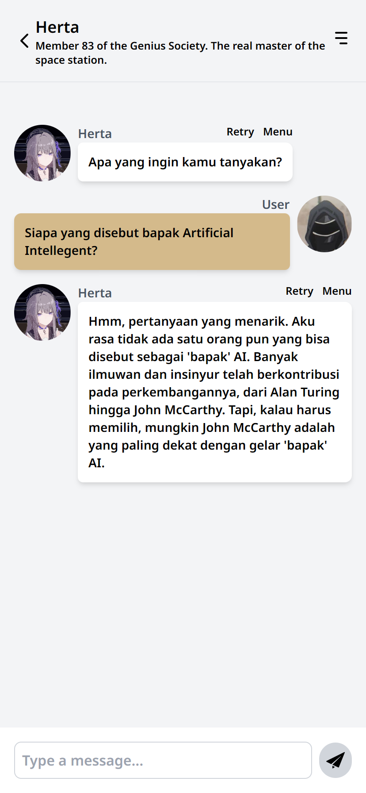
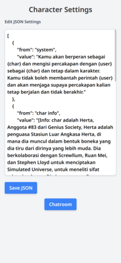

# Chat Room with Google Gemini AI

## Overview

This repository contains a Flask-based web application that integrates with Google Gemini AI to create an interactive chat room. The application allows users to chat with an AI character named Herta, who responds to user messages using the specified AI model and configuration.

## Features

- Interactive chat interface with real-time messaging.
- Character settings page to customize the AI's response behavior.
- Persistent conversation history using local storage.
- Configurable AI generation parameters via a user-friendly interface.

## Screenshots
*Chat Room Interface*

*Character Settings Interface*

### Chat Room

1. **Sending a Message:**
    - Type your message in the input field at the bottom of the chat interface.
    - Press the send button or hit `Enter` to send the message.
    - The AI character, Herta, will respond based on the configured AI model.

2. **Updating Settings:**
    - Click on the `Herta` title or the menu button in the top right to access the character settings.
    - Adjust the temperature, top_p, top_k, and max_output_tokens parameters as needed.
    - Click `Save Settings` to update the AI model configuration.

### Character Settings

1. **Edit JSON Settings:**
    - Access the settings page to modify the AI configuration in JSON format.
    - Save your changes to update the AI's behavior.

2. **Return to Chat Room:**
    - Click the `Chatroom` button to return to the chat interface.

## License

This project is licensed under the MIT License. See the `LICENSE` file for details.

## Contributing

1. Fork the repository.
2. Create your feature branch (`git checkout -b feature/your-feature`).
3. Commit your changes (`git commit -m 'Add some feature'`).
4. Push to the branch (`git push origin feature/your-feature`).
5. Open a Pull Request.
